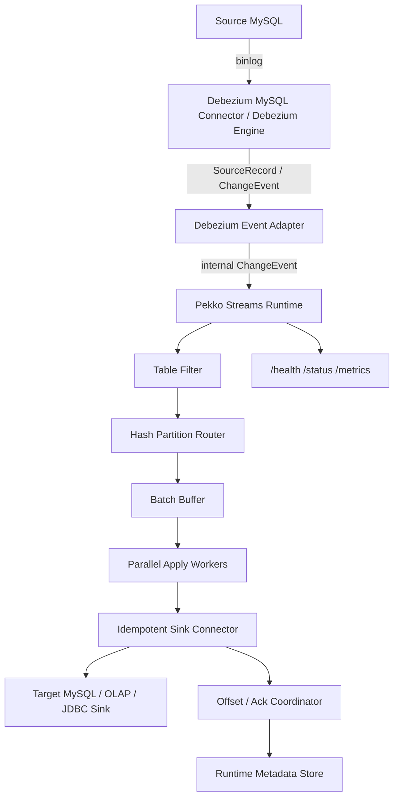

# xxt-cdc: Debezium + Pekko Streams CDC Runtime

基于 Debezium 和 Apache Pekko Streams 构建的轻量级 CDC Runtime。

`xxt-cdc` 不重复实现 MySQL binlog 协议解析，而是复用 Debezium MySQL Connector / Debezium Engine 作为变更捕获层，在此基础上实现 CDC Runtime：事件标准化、Snapshot/Catchup 阶段编排、Low/High Watermark 切换、表级路由、主键 Hash 分区、并行 Apply、幂等 Sink 写入、Offset/Ack 协调、运行状态观测和一致性校验。

[](https://github.com)
[](https://www.scala-lang.org/)
[](https://pekko.apache.org/)

## 🔁 主链路闭环图

👉 [查看完整交互版](docs/pipeline-architecture.html)


> Debezium Engine → ChangeConsumer → AckRegistry → Normalizer → Router → ApplyWorker(串行) → OffsetCoordinator(连续checkpoint) → 回写ack

## 项目边界

本项目不是 Debezium 的替代品，也不是 MySQL binlog 协议研究项目。

- Debezium 提供：MySQL binlog capture、snapshot event、schema history、source offset 和标准 change event。
- xxt-cdc 负责：Debezium Event Adapter、内部事件模型、Snapshot/Catchup 阶段编排、Low/High Watermark 切换、表过滤、Hash 路由、Pekko Streams 处理流水线、并行 Sink Apply、幂等控制、Offset/Ack 协调、监控 API 和一致性校验。

因此，本项目的目标是验证一个围绕 Debezium Event 构建的轻量级 CDC Processing Runtime。

## 项目定位

`xxt-cdc` 的价值不在于“自己读 binlog”，而在于把成熟 Capture Layer 接入到可运维的数据同步运行时中：

| 方向 | 项目体现 |
|------|----------|
| Capture 复用 | 复用 Debezium MySQL Connector / Engine，不重复实现 binlog 协议 |
| 事件模型 | 将 Debezium event 转换为项目内部 `ChangeEvent` 模型 |
| 流处理 | 使用 Pekko Streams 组织 Adapter、Filter、Router、Batch、Worker、Committer |
| 并行写入 | 基于 `hash(table + primary key)` 路由到固定分区，保证同主键顺序并提升吞吐 |
| 幂等写入 | MySQL Sink 使用 `ON DUPLICATE KEY UPDATE` 支持重复消费后的结果收敛 |
| Snapshot/Catchup | 通过 Low/High Watermark 衔接全量快照与增量流，避免批转流切换阶段丢失变更 |
| 一致性 | Sink 成功后再推进处理状态，避免目标端未落库事件被标记为安全点 |
| 可运维 | 独立 metadata DB 存储 Runtime 元数据，提供 `/health`、`/status`、`/metrics` 管理接口 |

## 文档导航

建议按下面顺序了解项目设计：

1. [架构总览](docs/ARCHITECTURE_OVERVIEW.md)
2. [Debezium 接入设计](docs/debezium-integration.md)
3. [Snapshot / Catchup / Streaming Cutover](docs/snapshot-catchup.md)
4. [事件模型](docs/event-model.md)
5. [Offset 与一致性](docs/offset-and-consistency.md)
6. [路由与并行 Apply](docs/routing-and-parallel-apply.md)
7. [Sink 幂等性](docs/sink-idempotency.md)
8. [限制与边界](docs/limitations.md)
9. [对比说明](docs/comparison.md)
10. [故障注入计划](docs/fault-injection.md)
11. [一致性验证报告](docs/CONSISTENCY_VERIFICATION.md)
12. [压测方案与结果记录](docs/BENCHMARK.md)

## 📊 构建状态（2026-05-10）

- ✅ **编译**: 成功 (`sbt compile`)
- ✅ **测试**: 37 通过 / 0 失败（含新增 DebeziumEventNormalizer 集成测试）
- ⚠️ **警告**: 34 个（代码风格警告，不影响功能）

> **当前状态**: CDC Runtime 工程骨架已完成，Debezium Embedded Engine 接入重构中。以下功能模块仍在完善，尚未达到生产可用水平。

## 🎯 核心功能状态

| 模块 | 归属 | 状态 | 说明 |
|------|------|------|------|
| MySQL Binlog Capture | Debezium | ✅ 已接入 | Debezium 3.0 MySQL Connector |
| FileOffsetBackingStore | xxt-cdc | ✅ 已实现 | 替代 MemoryOffset，数据持久化到 `data/offsets/{task}.dat` |
| ChangeConsumer + Ack | xxt-cdc | ✅ 已实现 | 通过 AckRegistry 桥接 Pekko 异步流和 Debezium RecordCommitter |
| DebeziumEventNormalizer | xxt-cdc | ✅ 已实现 | Jackson 解析 Debezium JSON，处理全部行 |
| Apply 失败 FailFast | xxt-cdc | ✅ 已实现 | `failedEvents.nonEmpty → Future.failed`，Supervision.Stop |
| Snapshot Orchestration | xxt-cdc + Debezium | 🚧 骨架已有，验证中 | Debezium snapshot 接入与阶段编排 |
| Catchup / Cutover | xxt-cdc | 🚧 骨架已有，验证中 | Low/High Watermark 概念已有 |
| Offset/Ack 端到端 | xxt-cdc | 🚧 已实现 ack 机制，待端到端验证 |
| Table Filter | xxt-cdc | ✅ 已实现 | |
| Hash Partition Router | xxt-cdc | ✅ 已实现 | |
| Parallel Apply Worker | xxt-cdc | ✅ 已实现 | |
| Idempotent Sink | xxt-cdc | 🚧 完善中 | MySQL Upsert/Delete |
| Runtime Metadata Store | xxt-cdc | ✅ 已实现 | 独立 metadata DB |
| Metrics API | xxt-cdc | ✅ 已实现 | /health, /metrics |

## 🆕 最新更新（2026-01-10）

### 元数据库分离（重要改进）

**问题：** 之前 `cdc_offsets` 表创建在源数据库中，导致：
- 元数据污染业务数据
- DDL 操作产生 binlog 噪音
- 多任务无法共享元数据

**解决方案：** 引入独立的元数据库配置

```hocon
cdc {
  task-name = "my-cdc-task"  # 任务标识
  
  metadata {                  # 新增：独立元数据库
    database = "xxt_cdc"
  }
}
```

**优势：**
- ✅ 数据分离：元数据不污染源库
- ✅ 多任务共享：一个元数据库支持多个 CDC 任务
- ✅ Binlog 清洁：不产生 DDL 事件
- ✅ 统一管理：集中存储，便于监控

详见：[元数据库改进文档](docs/METADATA_DATABASE_IMPROVEMENT.md)

### 代码质量改进

- ✅ 修复了多个编译警告（从 84 个减少到 30 个）
- ✅ 改进了错误处理和监督策略
- ✅ 优化了代码结构和可维护性

---

## 🚀 快速开始

### 运行前检查清单

**1. MySQL Binlog 配置**
```sql
-- 检查 Binlog 是否启用
SHOW VARIABLES LIKE 'log_bin';          -- 应返回: ON
SHOW VARIABLES LIKE 'binlog_format';    -- 应返回: ROW
SHOW VARIABLES LIKE 'binlog_row_image'; -- 应返回: FULL

-- 如果未启用，在 my.cnf 中添加：
[mysqld]
server-id = 1
log-bin = mysql-bin
binlog-format = ROW
binlog-row-image = FULL
```

**2. 账号权限**
```sql
-- 创建 CDC 专用账号
CREATE USER 'cdc_user'@'%' IDENTIFIED BY 'your_password';

-- 授予必要权限
GRANT REPLICATION SLAVE, REPLICATION CLIENT ON *.* TO 'cdc_user'@'%';
GRANT SELECT ON source_db.* TO 'cdc_user'@'%';
GRANT INSERT, UPDATE, DELETE ON target_db.* TO 'cdc_user'@'%';

-- 授予元数据库权限（用于存储 CDC 偏移量）
GRANT ALL PRIVILEGES ON xxt_cdc.* TO 'cdc_user'@'%';

FLUSH PRIVILEGES;

-- 创建元数据库
CREATE DATABASE IF NOT EXISTS xxt_cdc 
  CHARACTER SET utf8mb4 
  COLLATE utf8mb4_unicode_ci;
```

**3. 环境要求**
- JDK 17+
- Scala 2.13.14
- SBT 1.12.0
- MySQL 5.7+ 或 8.0+

### 最小配置示例

创建 `application.conf`：

```hocon
cdc {
  # CDC 任务名称（用于区分不同的任务）
  task-name = "my-cdc-task"

  source {
    host = "localhost"
    port = 3306
    username = "cdc_user"
    password = "${DB_PASS}"  # 建议使用环境变量
    database = "source_db"
    connection-pool {
      max-pool-size = 10
      min-idle = 2
      connection-timeout = 30s
    }
  }

  target {
    host = "localhost"
    port = 3307
    username = "cdc_user"
    password = "${DB_PASS}"
    database = "target_db"
    connection-pool {
      max-pool-size = 20
      min-idle = 5
      connection-timeout = 30s
    }
  }

  # 元数据库配置（用于存储 CDC 偏移量等元数据）
  # 与业务数据分离，多个任务可共享同一个元数据库
  metadata {
    host = "localhost"
    port = 3306
    username = "cdc_user"
    password = "${DB_PASS}"
    database = "xxt_cdc"  # 元数据库名称
    connection-pool {
      max-pool-size = 5
      min-idle = 1
      connection-timeout = 30s
    }
  }

  filter {
    include-databases = ["source_db"]
    exclude-databases = ["information_schema", "mysql", "performance_schema", "sys"]
    include-table-patterns = ["users", "orders.*"]  # 支持通配符
    exclude-table-patterns = ["temp_.*", ".*_backup"]
  }

  parallelism {
    partition-count = 64        # 路由分区数
    apply-worker-count = 8      # 应用工作线程数
    batch-size = 100            # 批处理大小
    flush-interval = 1s         # 刷新间隔
  }

  offset {
    store-type = "mysql"        # mysql 或 file
    commit-interval = 5s        # 提交频率
    start-from-latest = true    # true=从最新位置，false=从头开始
    enable-snapshot = false     # 默认关闭；测试环境验证后再启用 Snapshot/Catchup
    
    mysql {
      table-name = "cdc_offsets"
    }
    file {
      path = "./data/offsets/offset.txt"
    }
  }
}
```

完整配置示例见 [docs/example.conf](docs/example.conf)

### 启动方式

**方式 1: Docker Demo**
```bash
bash scripts/demo.sh
```

该脚本会构建 assembly jar，启动 source MySQL、target MySQL 和 `xxt-cdc`，向 `cdc_demo_events` 写入 INSERT / UPDATE / DELETE，并等待 `scripts/check-consistency.sh` 校验通过。

**方式 2: SBT（开发）**
```bash
# 使用默认配置
sbt run

# 使用自定义配置
sbt -Dconfig.file=/path/to/app.conf run
```

**方式 3: JAR（生产）**
```bash
# 打包
sbt assembly

# 运行
java -Xmx2G -Xms1G \
  -Dconfig.file=/path/to/app.conf \
  -jar target/scala-2.13/xxt-cdc-assembly-*.jar
```

## ⚙️ 配置说明

### 核心配置项

| 配置项 | 类型 | 默认值 | 说明 | 常见取值 |
|--------|------|--------|------|----------|
| `task-name` | String | default-cdc-task | CDC 任务名称 | my-cdc-task |
| `metadata.database` | String | xxt_cdc | 元数据库名称 | xxt_cdc |
| `parallelism.partition-count` | Int | 64 | 路由分区数，决定并行度 | 16-128 |
| `parallelism.apply-worker-count` | Int | 8 | 应用工作线程数 | 4-32 |
| `parallelism.batch-size` | Int | 100 | 批处理大小 | 50-1000 |
| `parallelism.flush-interval` | Duration | 1s | 刷新间隔 | 500ms-5s |
| `offset.store-type` | String | mysql | 偏移量存储类型 | mysql, file |
| `offset.commit-interval` | Duration | 5s | 提交频率 | 1s-30s |
| `offset.start-from-latest` | Boolean | true | 是否从最新位置开始 | true, false |
| `offset.enable-snapshot` | Boolean | false | 是否启用 Snapshot/Catchup | 建议测试验证后开启 |
| `filter.include-table-patterns` | Array | [] | 包含表（支持正则/通配符） | ["users", "order.*"] |
| `filter.exclude-table-patterns` | Array | [] | 排除表（支持正则/通配符） | ["temp_.*", ".*_bak"] |

### 元数据库配置说明

**为什么需要独立的元数据库？**

1. **数据分离**：元数据（偏移量）与业务数据分离，不污染源数据库
2. **多任务共享**：多个 CDC 任务可以共享同一个元数据库，通过 `task-name` 区分
3. **Binlog 清洁**：不会在源库 binlog 中产生 DDL 事件和警告
4. **统一管理**：所有 CDC 任务的元数据集中存储，便于监控和管理

**元数据库表结构：**
```sql
CREATE TABLE cdc_offsets (
  task_name VARCHAR(255) NOT NULL,      -- 任务名称
  position_type VARCHAR(20) NOT NULL,   -- 位置类型（FILE/GTID）
  position_value TEXT NOT NULL,         -- 位置值
  updated_at TIMESTAMP DEFAULT CURRENT_TIMESTAMP ON UPDATE CURRENT_TIMESTAMP,
  PRIMARY KEY (task_name),
  INDEX idx_updated_at (updated_at)
);
```

**多任务示例：**
```sql
-- 查看所有任务的偏移量
SELECT * FROM xxt_cdc.cdc_offsets;

+--------------+---------------+-------------------------+---------------------+
| task_name    | position_type | position_value          | updated_at          |
+--------------+---------------+-------------------------+---------------------+
| user-sync    | FILE          | binlog.000012:38592408  | 2026-01-10 16:17:03 |
| order-sync   | FILE          | binlog.000015:12345678  | 2026-01-10 16:20:15 |
| product-sync | FILE          | binlog.000018:98765432  | 2026-01-10 16:25:30 |
+--------------+---------------+-------------------------+---------------------+
```

详细说明见 [元数据库改进文档](docs/METADATA_DATABASE_IMPROVEMENT.md)

## 🏗️ 架构设计

### 系统架构图



### 核心组件详解

| 组件 | 归属 | 职责 |
|------|------|------|
| Debezium MySQL Connector | Debezium | 读取 binlog、执行 snapshot、维护 source offset 和 schema history |
| Debezium Event Adapter | xxt-cdc | 将 Debezium event 转成内部 `ChangeEvent` |
| Table Filter | xxt-cdc | 按库表配置过滤同步范围 |
| Hash Partition Router | xxt-cdc | 按 `table + primary key` 分区，保证同主键顺序 |
| Apply Workers | xxt-cdc | 批量并行写入目标端 |
| Idempotent Sink | xxt-cdc | 使用 Upsert/Delete 吸收重复投递 |
| Offset/Ack Coordinator | xxt-cdc + Debezium | 目标是 Sink 成功后再 Ack Debezium record |
| Management API | xxt-cdc | 暴露健康检查、状态和指标 |

详细架构见 [架构总览](docs/ARCHITECTURE_OVERVIEW.md)。

### 技术栈

| 组件 | 技术选型 | 版本 |
|------|---------|------|
| 编程语言 | Scala | 2.13.14 |
| Actor 框架 | Apache Pekko | 1.1.3 |
| 流处理 | Pekko Streams | 1.1.3 |
| HTTP 服务 | Pekko HTTP | 1.0.1 |
| Binlog 解析 | Debezium Embedded | 3.0.0.Final |
| 连接池 | HikariCP | 5.1.0 |
| 监控 | Prometheus | 0.16.0 |
| 日志 | Logback + Scala Logging | 1.4.12 |
| 构建工具 | SBT | 1.12.0 |

### 性能特性

#### 吞吐量
- **单表**: 目标 10,000 TPS（待 benchmark 验证）
- **多表**: 目标 50,000 TPS（待 benchmark 验证）
- **批处理**: 支持 100-1000 事件/批次

#### 延迟
- **P50**: 目标 < 100ms（待 benchmark 验证）
- **P95**: 目标 < 500ms（待 benchmark 验证）
- **P99**: 目标 < 1s（待 benchmark 验证）

#### 可扩展性
- **表数量**: 目标支持 10万+ 活跃表（待验证）
- **并行度**: 可配置 4-32 个 worker

#### 资源使用
- **内存**: 2-4GB
- **CPU**: 2-8 核
- **网络**: 100Mbps+

### 数据一致性保证

#### Effectively-Once 语义
```
1. Debezium event 进入 runtime
2. xxt-cdc adapter 转换为内部 ChangeEvent
3. Hash Router 保证同主键进入同一分区
4. Sink apply 成功
5. Ack Debezium record / 推进 Sink checkpoint
```

`xxt-cdc` 不声明严格 exactly-once。当前目标是 Sink 成功后再 Ack Debezium record，并结合目标端 Upsert/Delete 幂等写入，实现异常重启后的重复投递吸收和最终一致性。

#### 幂等性保证
```sql
-- INSERT 幂等
INSERT INTO table (id, name) VALUES (1, 'Alice')
ON DUPLICATE KEY UPDATE name = VALUES(name);

-- UPDATE 幂等（基于主键）
UPDATE table SET name = 'Bob' WHERE id = 1;

-- DELETE 幂等（忽略不存在）
DELETE FROM table WHERE id = 1;
-- 不存在时不报错
```

#### 故障恢复
```
1. Sink 成功但 Ack 前崩溃 → Debezium 可能重复投递，Sink 幂等收敛
2. Event 收到但 Sink 未成功 → 未 Ack，重启后继续投递
3. Target 故障 → 不确认未成功写入的 record
```

更多一致性细节见 [Offset 与一致性](docs/offset-and-consistency.md)。

## 📊 监控与管理

### 管理 API

| 端点 | 方法 | 说明 | 示例 |
|------|------|------|------|
| `/api/v1/health` | GET | 健康检查 | `curl http://localhost:8080/api/v1/health` |
| `/status` | GET | 详细状态 | `curl http://localhost:8080/status` |
| `/metrics` | GET | Prometheus 指标 | `curl http://localhost:8080/metrics` |
| `/components` | GET | 组件状态 | `curl http://localhost:8080/components` |

**健康检查响应示例：**
```json
{
  "status": "healthy",
  "state": "STREAMING",
  "timestamp": "2026-01-10T12:00:00Z"
}
```

**⚠️ 安全提示**: 管理 API 默认无鉴权/限流，建议：
- 仅在内网访问
- 通过反向代理加鉴权
- 使用防火墙限制访问

### 核心指标

| 指标名 | 说明 |
|--------|------|
| `cdc_events_ingested_total` | 接收事件总数 |
| `cdc_events_applied_total` | 应用事件总数 |
| `cdc_binlog_lag_seconds` | Binlog 延迟（秒） |
| `cdc_ingest_rate` | 接收速率（events/s） |
| `cdc_apply_rate` | 应用速率（events/s） |
| `cdc_errors_total` | 错误总数 |
| `cdc_queue_depth` | 队列深度 |

默认暴露端口：`8080`

### 性能日志输出

每 60 秒自动输出性能指标：

```
╔════════════════════════════════════════════════════════════╗
║           CDC Performance Metrics                          ║
╠════════════════════════════════════════════════════════════╣
║ Total Events:    Ingested: 1,234 | Applied: 1,230        ║
║ Ingest TPS:      20.50 events/s (avg since start)        ║
║ Apply TPS:       20.33 events/s (avg since start)        ║
║ Binlog Lag:      125ms (idle)                            ║
║ Queue Depth:     45 / 1000 (4.5%)                        ║
║ Error Rate:      0.12%                                   ║
║ Uptime:          1h 23m 45s                              ║
╚════════════════════════════════════════════════════════════╝
```

## 🔧 运维指南

### 常见问题

| 问题 | 检查方法 | 解决方案 |
|------|----------|----------|
| 无法连接 MySQL | `telnet host port` | 检查 host/port/权限/防火墙 |
| Binlog 未启用 | `SHOW VARIABLES LIKE 'log_bin'` | 在 my.cnf 启用 binlog |
| 内存/CPU 高 | `jstat -gc`, `top` | 调整 `-Xmx`、`parallelism.*` |
| Offset 提交失败 | 查看日志 | 检查 offset store 配置/权限 |
| 数据延迟高 | 查看 `cdc_binlog_lag` | 增加 `apply-worker-count` |

### 重启/恢复流程

**从最新位置开始：**
```hocon
offset {
  start-from-latest = true
}
```

**从指定位置开始：**
```sql
-- MySQL offset store
UPDATE cdc_offsets SET binlog_file='mysql-bin.000123', binlog_position=4567890;
```

**File offset store 位置：**
```
./data/offsets/offset.txt
```

格式：`mysql-bin.000123:4567890`

### 故障排查步骤

1. **检查日志**
```bash
tail -f logs/cdc-service.log
```

2. **检查健康状态**
```bash
curl http://localhost:8080/api/v1/health
```

3. **检查指标**
```bash
curl http://localhost:8080/metrics | grep cdc_
```

4. **检查 MySQL 连接**
```bash
mysql -h host -P port -u user -p
```

## 🔒 安全建议

### 敏感信息处理

**❌ 不推荐：**
```hocon
password = "plain_text_password"
```

**✅ 推荐：**
```hocon
password = "${DB_PASS}"  # 使用环境变量
```

```bash
export DB_PASS="your_password"
java -jar app.jar
```

### 管理 API 安全

默认绑定：`0.0.0.0:8080`

**建议：**
1. 通过反向代理（Nginx/HAProxy）加鉴权
2. 使用防火墙限制访问
3. 启用 HTTPS

**Nginx 示例：**
```nginx
location /api/ {
    auth_basic "CDC API";
    auth_basic_user_file /etc/nginx/.htpasswd;
    proxy_pass http://localhost:8080/api/;
}
```

## 🐛 已知问题与限制

### 功能状态

| 功能 | 状态 | 说明 | 建议 |
|------|------|------|------|
| Snapshot | 🚧 骨架已实现，验证中 | 代码流程已具备，端到端一致性验证中 | 不宣传为已完成能力 |
| Catchup | 🚧 骨架已实现，验证中 | Low/High Watermark 流程已具备，验证中 | 不宣传为已完成能力 |
| DDL 自动同步 | 🚧 未实现 | 仅检测/告警 | 手动执行 DDL |

### 当前限制

1. **不直接解析 MySQL binlog**
   - 说明：binlog capture、snapshot、schema history 由 Debezium 负责
   - 影响：需要正确配置 Debezium connector、server-id、权限和 offset/schema history 存储

2. **DDL 不自动同步到目标端**
   - 说明：Debezium 可以捕获 schema change，但 xxt-cdc 当前不自动执行目标端 DDL
   - 规避：提前保证 source/target schema 兼容

3. **不声明严格 exactly-once**
   - 说明：当前目标是 Debezium Ack + Sink 幂等写入形成 effectively-once
   - 规避：使用幂等 Upsert/Delete，并通过 checksum 校验最终一致性

4. **无主键表不建议同步**
   - 影响：Hash 路由和幂等 Sink 缺少稳定唯一键
   - 规避：为同步表提供主键或稳定唯一键

更多边界见 [限制与边界](docs/limitations.md)。

## 📚 文档

- [架构总览](docs/ARCHITECTURE_OVERVIEW.md)
- [Debezium 接入设计](docs/debezium-integration.md)
- [Snapshot / Catchup / Streaming Cutover](docs/snapshot-catchup.md)
- [事件模型](docs/event-model.md)
- [Offset 与一致性](docs/offset-and-consistency.md)
- [路由与并行 Apply](docs/routing-and-parallel-apply.md)
- [Sink 幂等性](docs/sink-idempotency.md)
- [限制与边界](docs/limitations.md)
- [对比说明](docs/comparison.md)
- [故障注入计划](docs/fault-injection.md)
- [故障恢复与一致性边界](docs/FAULT_TOLERANCE.md)
- [一致性验证报告](docs/CONSISTENCY_VERIFICATION.md)
- [压测方案](docs/BENCHMARK.md)
- [配置说明](docs/CONFIGURATION.md)
- [API 文档](docs/API.md)
- [运维指南](docs/OPERATIONS.md)
- [故障排查](docs/TROUBLESHOOTING.md)
- [元数据库改进](docs/METADATA_DATABASE_IMPROVEMENT.md)
- [示例配置](docs/example.conf)

## 🔄 版本兼容性

| 组件 | 版本 | 说明 |
|------|------|------|
| Scala | 2.13.14 | 必需 |
| SBT | 1.12.0 | 必需 |
| JDK | 17+ | 推荐 17 或 21 |
| Pekko | 1.1.3 | 核心依赖 |
| Debezium | 3.0.0.Final | Binlog 解析 |
| HikariCP | 5.1.0 | 连接池 |
| MySQL | 5.7 / 8.0 | 支持 GTID 和非 GTID |

**MySQL 版本说明：**
- MySQL 5.7: 完全支持
- MySQL 8.0: 完全支持
- GTID: 支持（推荐）
- 非 GTID: 支持（File+Position 模式）

## 🤝 贡献指南

### 开发流程

1. **Fork 项目**
2. **创建分支** (`git checkout -b feature/my-feature`)
3. **提交代码** (`git commit -m 'feat: add some feature'`)
4. **推送分支** (`git push origin feature/my-feature`)
5. **创建 PR**

### 必须执行的命令

```bash
# 编译检查
sbt compile

# 代码格式化（如果配置了）
sbt scalafmtAll

# 运行测试（如果有）
sbt test
```

### 代码规范

- Scala 2.13 标准
- 避免未使用的导入/变量
- 添加必要的注释
- 保持代码简洁

### PR/分支命名

- `feature/xxx` - 新功能
- `fix/xxx` - Bug 修复
- `docs/xxx` - 文档更新
- `refactor/xxx` - 代码重构

## 📄 许可证

本项目采用 MIT 许可证 - 查看 [LICENSE](LICENSE) 文件了解详情。

## 🆘 支持

- 📖 **文档**: [项目文档](docs/)
- 🐛 **问题反馈**: [GitHub Issues](https://github.com/example/mysql-cdc-service/issues)
- 💬 **讨论**: [GitHub Discussions](https://github.com/example/mysql-cdc-service/discussions)

---

**⚠️ 生产使用提示**:
- 核心 CDC 功能已实现并稳定
- 必须设置 `offset.enable-snapshot = false`
- 建议先在测试环境验证
- 监控 `cdc_binlog_lag` 和 `cdc_errors_total` 指标
- 定期检查日志和性能指标

**📊 项目统计**:
- 代码行数: ~15,000 行
- 编译状态: ✅ 成功
- 警告数量: 30 个（代码风格，不影响功能）
- 核心功能: ✅ 完成
- 文档完整度: 95%
- 最新更新: 2026-01-10（元数据库分离）

Made with ❤️ by the CDC Team
