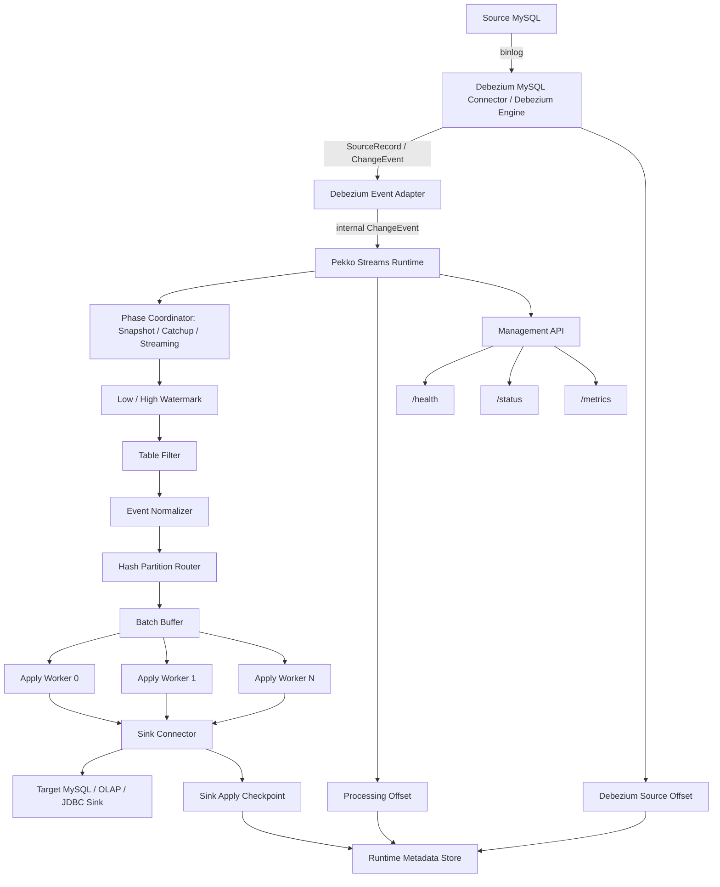

# 架构总览

`xxt-cdc` 是一个基于 Debezium + Apache Pekko Streams 的轻量级 CDC Processing Runtime。项目边界是：Debezium 提供数据库变更捕获原语，xxt-cdc 负责 CDC 运行时编排，包括 Debezium Event 之后的标准化、Snapshot/Catchup 阶段切换、Low/High Watermark、路由、并行写入、幂等、Offset/Ack 协调、监控和一致性验证。

## 总体架构



## 分层设计

### 1. Debezium Capture Layer

Debezium 提供 MySQL binlog capture、snapshot event、schema history 和 source offset。xxt-cdc 不直接解析 MySQL binlog 协议，也不重复实现 Debezium 已经成熟解决的底层捕获能力。

### 2. Event Adapter Layer

Adapter 将 Debezium 输出的 event 转换为项目内部事件模型，避免 Debezium 原始对象在整个系统中扩散。后续 routing、apply、consistency 都只依赖内部模型。

### 3. Stream Processing Layer

Pekko Streams 负责组织长生命周期处理链路：

```text
Debezium Event
-> Adapter
-> Phase Coordinator
-> Low/High Watermark
-> Table Filter
-> Event Normalizer
-> Hash Partition Router
-> groupedWithin(batchSize, flushInterval)
-> Parallel Apply Worker
-> Offset/Ack Coordinator
```

Snapshot/Catchup 不是简单的 Debezium 开关。Debezium 提供 snapshot/binlog event 和 source offset，xxt-cdc 负责把全量阶段、追赶阶段和稳定流式阶段组织成可恢复的运行时状态机。

```text
INIT -> SNAPSHOT -> CATCHUP -> STREAMING
```

Low Watermark 用于记录进入全量阶段前的增量边界，High Watermark 用于记录全量阶段结束后的切换边界。Catchup 阶段负责处理这两个边界之间可能和快照重叠的变更，并在 Sink apply 与 checkpoint 安全后切换到 Streaming。

### 4. Sink Apply Layer

Sink 层负责目标端写入。MySQL Sink 使用 Upsert/Delete 的幂等写法吸收失败恢复时可能出现的重复投递。

### 5. Offset & Metadata Layer

系统区分三类进度：

| Offset 类型 | 归属 | 作用 |
|-------------|------|------|
| Debezium Source Offset | Debezium | 记录 binlog / snapshot 读取进度 |
| Stream Processing Offset | xxt-cdc | 记录事件进入 runtime 后的处理位置 |
| Sink Checkpoint | xxt-cdc | 记录目标端成功 apply 到哪里 |

核心原则是：Sink apply 成功前不能确认 Debezium record 已处理。否则会出现 Debezium offset 已推进但目标端未写入的丢数据风险。

### 6. Observability Layer

运行时通过 HTTP API 和 Prometheus 指标暴露健康状态、吞吐、延迟、错误和组件状态。

## 设计取舍

- 使用 Debezium：复用成熟 CDC capture 能力，把项目重点放在 event processing runtime。
- 使用 Pekko Streams：CDC 是长生命周期流处理任务，需要背压、批量、分区、监督和可组合 pipeline。
- 使用 Hash Router：同表同主键进入同一分区，保证局部顺序。
- 使用幂等 Sink：允许重启后重复投递，通过 Upsert/Delete 让最终结果收敛。
- 使用独立 Metadata DB：运行时元数据不污染源库，也避免 metadata 写入进入业务 binlog。

## 当前边界

- 当前主路线是 Embedded Debezium Engine 模式。
- Kafka Connect + Debezium 模式可作为生产部署扩展路线，但不是当前 demo 主路径。
- DDL 默认检测和告警，不自动修改目标端 schema。
- 不声明严格 exactly-once；当前目标是 Debezium Ack + Sink 幂等写入形成 effectively-once。
