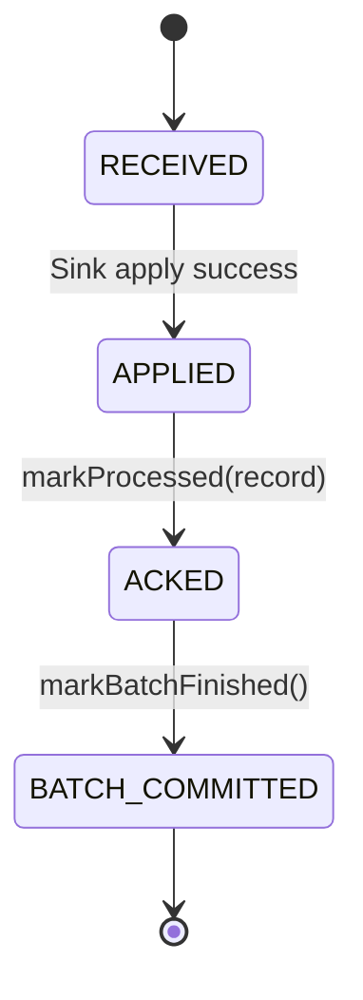

# Offset 与一致性

`xxt-cdc` 不声明严格 exactly-once。当前目标是通过 Debezium Ack 边界、Sink 幂等写入和一致性校验实现 effectively-once。

## 三类 Offset

| Offset 类型 | 归属 | 作用 |
|-------------|------|------|
| Debezium Source Offset | Debezium | 记录 binlog / snapshot 读取进度 |
| Stream Processing Offset | xxt-cdc | 记录事件进入 runtime 后的处理位置 |
| Sink Checkpoint | xxt-cdc | 记录目标端成功 apply 到哪里 |

Snapshot/Catchup 还会使用 Low/High Watermark 描述批转流切换边界。Watermark 不是替代 Debezium Source Offset，而是 `xxt-cdc` 基于 source offset 和 runtime metadata 记录的阶段边界：

- Low Watermark：进入 snapshot 前的增量边界。
- High Watermark：snapshot 完成后的增量边界。
- Catchup：处理 Low/High Watermark 范围内可能和 snapshot 重叠的变更，并在目标端收敛后进入 streaming。

## Ack 原则

如果使用 Debezium Engine 批量消费 API，`xxt-cdc` 应遵守：

```text
Sink apply 成功后，才调用 markProcessed(record)。
一个 batch 的所有事件成功 apply 后，才调用 markBatchFinished()。
```

也就是说，Debezium source offset 的推进必须晚于目标端成功写入。

## 状态机



当前代码中已有 `RECEIVED -> APPLIED -> COMMITTED` 的处理状态，后续应将 Debezium `RecordCommitter` ack 显式纳入这个状态机。

## 崩溃场景

### Sink 成功，Debezium offset 未 ack，进程崩溃

结果：

- 重启后 Debezium 可能重新投递该 batch。
- Sink 使用幂等 Upsert/Delete。
- 最终数据不重复。

### Debezium event 已收到，Sink 未成功，进程崩溃

结果：

- 未 ack Debezium record。
- 重启后继续消费。
- 不丢失。

### Debezium offset 已持久化，Sink 未成功

这是禁止状态。

`xxt-cdc` 必须避免在 Sink 成功前提交 Debezium offset，否则会出现目标端丢数据但 source offset 已跳过的不可恢复问题。

## 一致性策略

1. Sink apply 成功后再 Ack Debezium record。
2. 目标端使用幂等 Upsert/Delete。
3. 同一主键进入同一分区，保证局部顺序。
4. 重启后允许重复消费最后一个未提交 batch。
5. 通过 checksum / row count 校验最终一致性。
